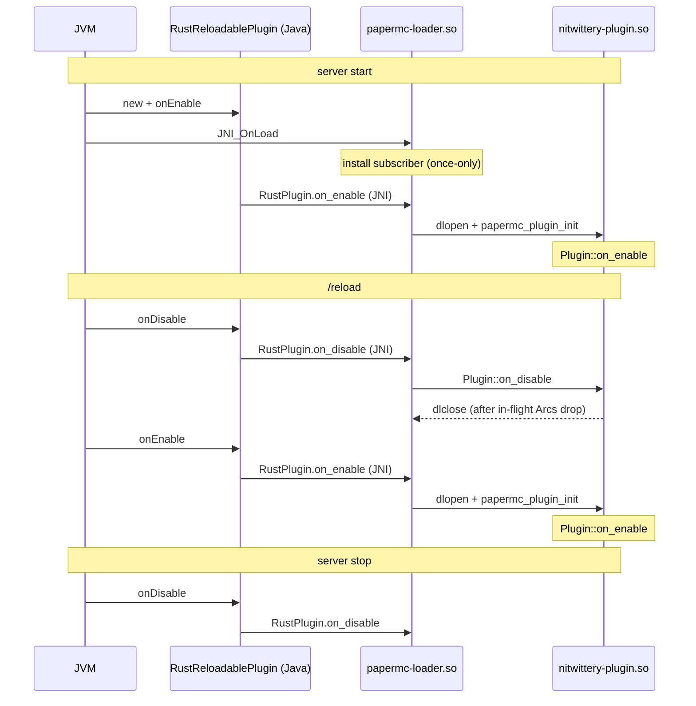
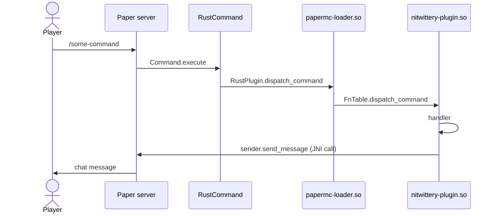

# Nitwittery Architecture

Nitwittery is a Minecraft Paper server plugin written in Rust. The Java side is kept as thin as
possible; nearly all behavior lives in Rust and talks to the Paper / Bukkit API through JNI.

Nitwittery's goal is to make Minecraft villagers / villages more interesting.

# Project layout

* docs/ - design documentation and ideas

* Makefile - top-level build orchestrator. It drives Gradle (Java) and Cargo (Rust) independently;
  neither build system knows about the other.

* papermc-loader/ - produces `libpapermc_loader.so`, the stable native library that the
  `RustReloadablePlugin` Java class loads through papermc's `NativeLoader`.

  The loader then `dlopen`s the `libnitwittery_plugin.so`, which is where the plugin's actual Rust
  code lives. The extra hop exists because the JVM cannot unload a native DSO once it has been
  loaded: a stable, never-unloaded loader can `dlclose` and re-`dlopen` the plugin .so to support
  `/reload` without restarting the server.

  papermc-loader/ is meant to be stable. New plugin functionality should not require changes here;
  it exists only to broker the Java <-> plugin handoff.

* papermc/ - both the shared Rust / Java interface library AND the Java module that the consumer
  plugin depends on. The Rust crate wraps the JNI surface. The Java sources provide the base
  `RustReloadablePlugin` JavaPlugin, the native-library loader, the tracing-subscriber bridge, and
  the command / event executor bridges.

  This module will grow to contain a Rust wrapper around the Bukkit / Paper Java plugin API. The
  goal is to mirror the Bukkit / Paper API in Rust so plugin code reads naturally; we depart from
  the Java shape only when language differences force the issue.

* nitwittery-plugin/ - the plugin itself. The Rust crate implements the `papermc::Plugin` trait and
  registers handlers via `SetupApi`. The Gradle config packages a Bukkit plugin jar that bundles the
  papermc Java module and `src/main/resources/plugin.yml`.

# Plugin lifecycle

The JVM cannot unload a native DSO. papermc-loader is the never-unloaded stub that `dlopen`s and
`dlclose`s the plugin DSO in the `/reload` cycle, so that iterating on Rust code only requires
`/reload` rather than a server restart.

# Java <-> Rust data flow

Java -> Rust calls in the `RustPlugin` Java class are implemented by C function pointers stored in
`FnTable`. Rust -> Java calls go through the JVM via the JNI environment.
